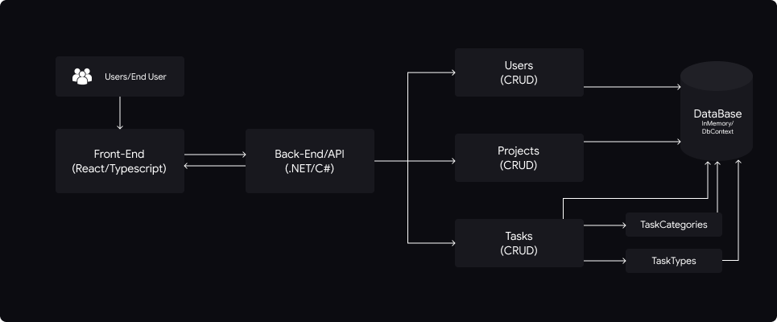

# Timelogger ⏲️

## Overview

Timelogger is an application that manages projects and their respective tasks. With its main focus on logging the time dedicated to each task, Timelogger gives users an overview of the project's progress and productivity.

## Architecture

The application was developed using an architecture based on the MVC (Model-View-Controller) pattern. Below is a detailed description of the system's architecture, including the technologies used and how the components interact with each other.

#### Technologies Used

- **Backend**: C#/.NET.
- **Frontend**: React with Typescript and Styled-components, and Jest for the tests.

#### Database Model

- Users
  - Roles (Freelances, Customers)
- Projects
- Tasks
  - TaskCategories
  - TaskTypes

#### Data Flow

1. **Authentication and Authorization**

- The user logins via the POST endpoint /auth/login.
- The backend validates the credentials and, if correct, generates a JWT token.
- The JWT token is used by the frontend to authenticate and authorize subsequent requests.

2. **Frontend-Backend Interaction**

- The frontend submits HTTP requests to the API endpoints.
- The backend, following the MVC pattern, processes these requests.
  - **Model**: Represents the structure of the data (e.g. Users, Projects, Tasks).
  - **View**: In the context of the backend, the “View” would be the API response in JSON format.
  - **Controller**: Contains the logic that responds to requests from the frontend (e.g. methods for creating, reading, updating and deleting data).

3. **CRUD Operations**

- Create: The frontend sends data to the backend to create new entries (e.g. new projects or tasks).
- Read: The frontend requests data from the backend (e.g. list of projects, tasks).
- Update: The frontend sends updated data to the backend to modify existing entries.
- Delete: The frontend asks the backend to delete specific entries.

#### Component Interaction

1. **Frontend**

- Interacts with the end user, collecting input and displaying data.
- Sends HTTP requests to the backend and processes the responses.

2. **Backend**

- Receives HTTP requests from the frontend.
- Cotrollers process the requests, interacting with the data models.
- Models represent the structure of the database and are manipulated by the controllers.
- Returns responses to the frontend, usually in JSON format.

3. **Database**

- Stores persistent data such as users, projects, tasks, categories and task types.
- Uses _InMemory/DbContext_ for data management.

## Documentation

For more detailed information on each component, **Front-end** and **Back-end**, access their respective documentation, which includes the entire installation and execution process.

- [Front-end Documentation](./client/README.md)
- [Back-end Documentation](./server/README.md)

## Project Goals

The entire project was developed on the basis of a challenge issued by the e-conomic team as part of the recruitment process. Let's review the objective points proposed by the team.

- [ ] As a freelancer I want to be able to register how I spend time on my projects, so that I can provide my customers with an overview of my work.
- [ ] As a freelancer I want to be able to get an overview of my time registrations per project, so that I can create correct invoices for my customers.
- [ ] As a freelancer I want to be able to sort my projects by their deadline, so that I can prioritise my work.

Thanks to everyone and it was a very nice challenge. 🎉