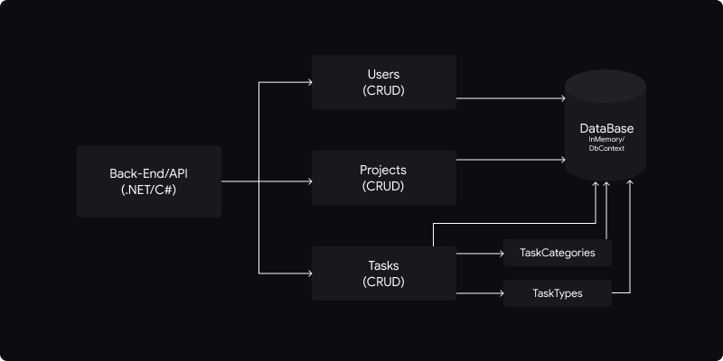

# Timelogger API ⏲️

## Overview

This is the API/Backend of our system, responsible for the entire data management process and for providing the essential functionalities for the application.

The application consists of a time manager for projects, where it is possible to manage projects and their respective tasks. The system offers JWT authentication for security and CRUD functionalities.

## Architecture

The **Timelogger** application was developed using an architecture based on the **MVC** (Model-View-Controller) standard. Diagram of the system's architecture is shown below.



## Getting Started

### Requirements

- **.NET Core 8.0**: To run the server you will need .NET Core 8.0. To download and install, follow the instructions in the documentation: [Microsoft .NET 8.0](https://dotnet.microsoft.com/en-us/download/dotnet/8.0).

### Preparing the environment

To prepare the environment and run the application, follow the instructions below:

1. Clone the repository.
2. Make sure you have the .NET 8 installed on your machine.
3. Navigate to the `/server` directory of the project.

### Running the application

1. Open the terminal in the `/server` directory of the project.
2. Run the command `dotnet restore` to restore nuget packages.

```powershell
  dotnet restore
```

3. Then, run the command `dotnet build` to build the solution.

```powershell
  dotnet build
```

4. Navigate to the `Timelogger.Api` directory: `cd /Timelogger.Api`.

```powershell
  d /Timelogger.Api/
```

5. The, run the command `dotnet run` to starts the server.

```powershell
  dotnet run
```

### Acessing the application

After the application is running, it will available at http://localhost:3001.
